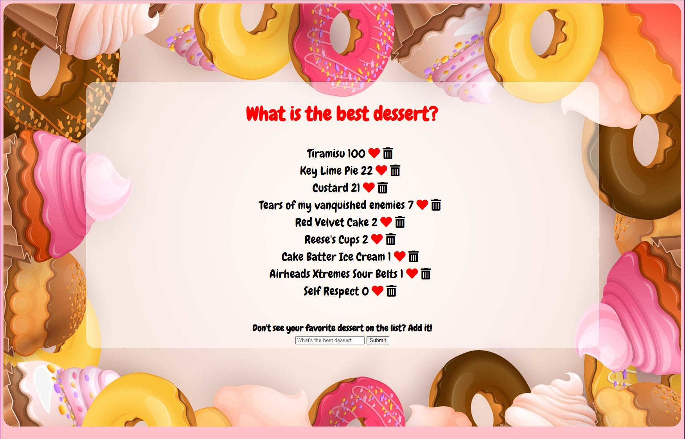

# What's the best dessert?
Users can add and vote on their favorite desserts. Submissions can only be deleted by those with the password or database access. 

**Link to project:** https://vote-best-dessert.herokuapp.com/

## How It's Made:

**Tech used:** HTML, CSS, JavaScript, Node, Express, MongoDB, Heroku

People spend a lot of time debating things like politics, religion, economy and more. What if we took a break from such topics to tofucs on something we all love, dessert? This simple CRUD app was great to not only practice some full-stack fundamentals but also served as something fun to share with firends, which almost immediately led to an all-out competition of who can get their dessert ranked #1. The focus on this project was to become more familiar with handling put, get, post, and delete requests via Express in Node.js along with rendering said requests via an .ejs template. The visual formatting was quickly put together utilizing flexbox and some flaticons. I may add some mobile-specific media queries at a later date. 

## Lessons Learned:

One of the key things I learned in this project was not to forget that I need to add my MongoDB access string to Heroku. Somehow doing this managed to slip my mind and it caused me quite a bit of frustration when trying to load my app outside of the localhost port. Note to self: just because I have a successful push and build with Heroku does not mean the .env variables will be there. 

Another learning point involved setting the password function for deleting items. I didn't want people deleting each other's submissions so I added a password. My mistake - adding the logic to the client-side main.js file which ultimately gave aynone the password should they check my github... The solution - move the logic to the server-side delete request. Bringing a lesson from blunder #1, I noticed the password function didn't work via my Heroku link. That's right, I had forgotten to add the password variable and value to Heorku. Fortunately it was only a few minutes before I realized thanks to my first experience. 

